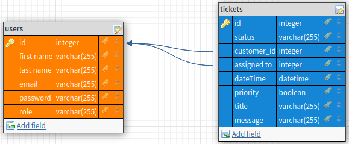

# A tomato challenge

## What?

making a ticket desk, [here is the excersiize](excersize.md)

## Who? 

a group project with:
- [Cis Magito](https://github.com/Beardificent)
- [Kayalin Van Kogelenberg](https://github.com/MonoraxXiV)
- [Xander Van der Herten](https://github.com/xandervdh)

## How?

We are using a [trello](https://trello.com/b/fJQVglRm/atomato-project) to organize everything.

Check it out if you want to see how far along we are.

### General checklist

- [x] making the entities
- [ ] making login and registration
- [ ] make authorization

## What did we do

- Looked at the database relations

- 